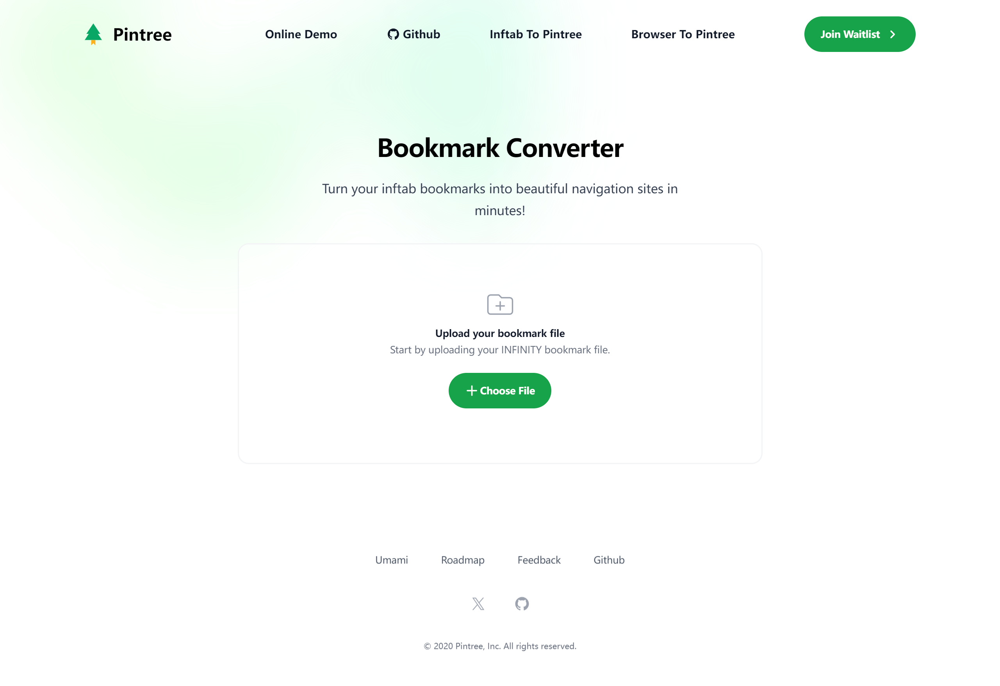
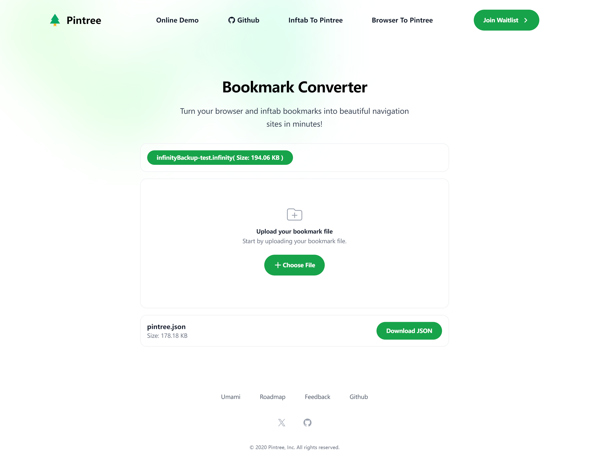

# 关于 inftab-to-pintree

此项目是基于pintree，用来把「inftab 新标签页」的书签 转换为 符合 pintree 格式的pintree.json文件。

### 一共写了两个版本：

1.只单纯的输出转换后的「inftab 新标签页」书签。

2.在原有的json-converter.js代码基础上，额外把 inftab书签 push进去。

### 制作背景：

浏览器书签量巨大，重要性由低到高，鱼龙混杂，平时看到只要有点用的页面都会存储。
没有根据优先级和需要进行摘选，书签量巨大的情况下，使用时极为不便。
而此「inftab书签」是作为浏览器书签的补充而存在，是对浏览器书签的优选和精选。
当然最重要原因是，之前一直在使用「inftab 新标签页」，其项目地址：https://inftab.com/。
为保持永久可用，故导从其服务器导出数据，适配开源的 pintree 以备不时之需。

### 代码相关：

##### 转换 「inftab 新标签页」书签 为 pintree 中单独的一个文件夹大类。

##### 调用方法：实例化 inftabToPintree类，调用其 convert方法。

##### 调用代码：`new inftabToPintree(jsonString).convert();`。

# pintree
An intuitive tool for managing and exporting your local bookmarks into a shareable website. 

## 本项目还没有正式发布，但是已经可以下载测试了，下面是一个简单的教程，按照下面流程操作即可
### Step 1：
下载这个项目到本地
### Step 2: 
下载你浏览器上的书签，Chrome在浏览器输入这个地址访问：chrome://bookmarks/
### Step 3: 
在Pintree官网把下载好的html书签文件转换成json格式，在这里转换：[pintree.io/json-converter](https://pintree.io/json-converter.html)
### Step 4: 
下载转换完成的json文件，替换本项目目录下的json文件 '/json/pintree.json'
### Step 5:
托管这个静态网站到Github或你自己的服务器即可。
